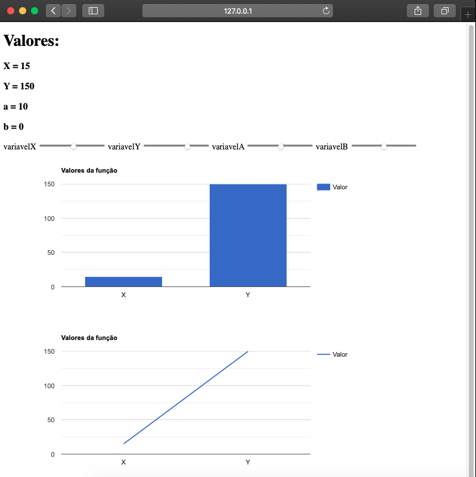

# Graficos_Web_Com_Google_Charts
Simples página web usando html5 e um script com javascript para gerar gráficos dinâmicos em tempo real. Os valores do input podem ser alterados pelas barras deslizantes na horizontal.

<h1 align="center">
  
</h1>
